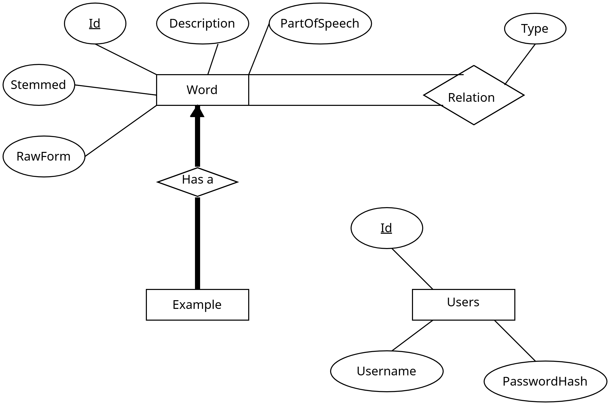

# Wordnet Dictionary Lookup
This project is written as part of the [Databases and Information Systems](https://kurser.ku.dk/course/ndab21010u) course at the University of Copenhagen.

It is a simple website allowing the user to search through a Wordnet Dictionary from [Kaggle](https://www.kaggle.com/datasets/dfydata/wordnet-dictionary-thesaurus-files-in-csv-format) and learn about the part of speech of a word, examples of usage and any synonyms/antonyms it might have.

To properly match a search term with a stored word, we use a regular expression (`util.py`) to clean the term of any special characters, lowercase it and perform stemming on it.

## Database Schema
The database schema is described by the following er diagram


## Usage instructions
1. Install Docker / [Docker Desktop](https://www.docker.com/products/docker-desktop/).
2. Create a virtual environment and install required packages with the command,
```powershell
pip install -r requirements.txt
```
3. Run `python app.py` while Docker is running. 
    - This will automatically set up a postgres container as well as the databse schema and the corresponding data. This however makes the startup time quite long (2-3 minutes).
4. Go to `localhost:5000/` and you will be prompted to login.
    - Choose "create one" in the bottom of the card and create a new user.
    - Now you can login with your new user and use the dictionary!

Examples of searches with examples and synonyms/antonyms:
- "extinguish"
- "establish"
- "predecessor"

## AI Declaration
The use of Generative AI has been kept to a minimum and only for trivial implementation such as frontend HTML/CSS templating/styling. Additionally it has been used as a reference tool to look up documentation and programming language subtleties. All non-trivial implementations and the overall design has been written by us.